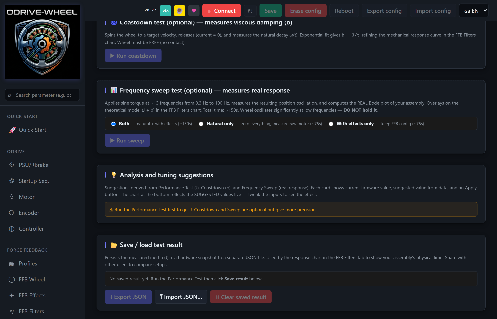
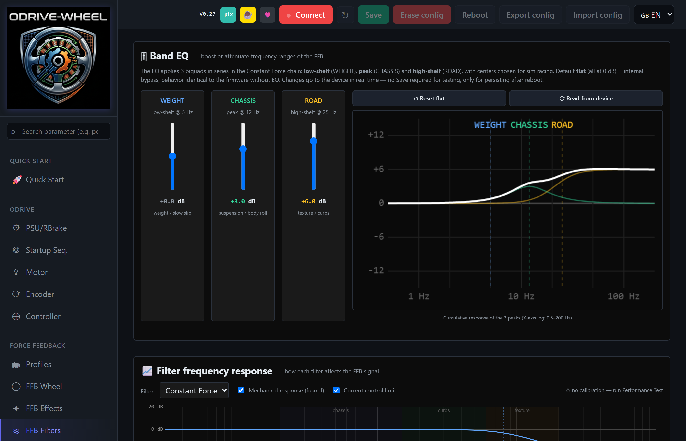
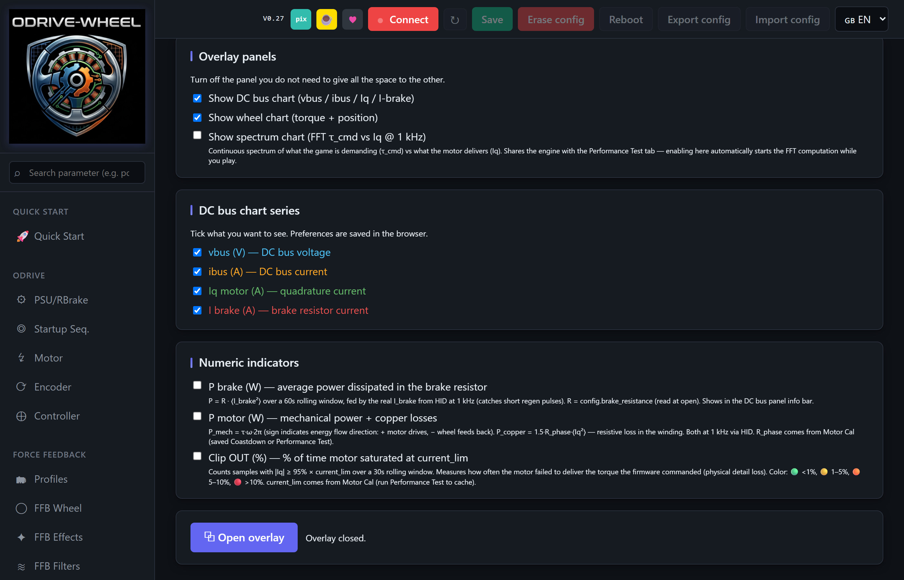
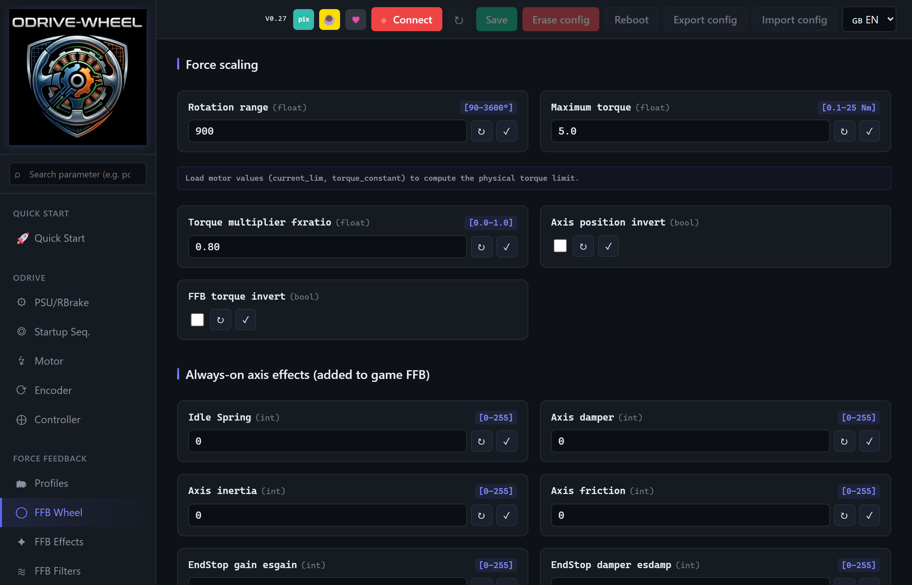
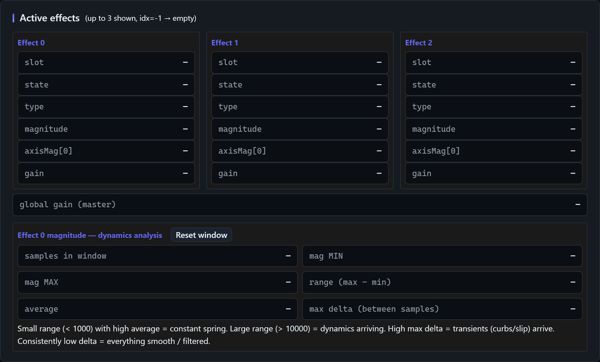
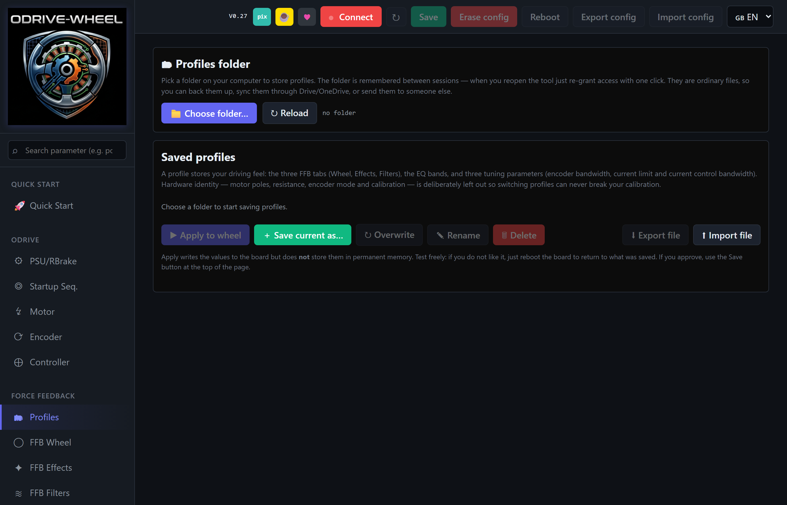

# Tutorial — Tuning the wheel feeling

<sub>🇧🇷 [Ler em português](TUNING_FEELING_PT.md)</sub>

Practical guide to tune the wheel "feel" using the built-in tools — from Performance Test, through the motor filters (CF/Damper/Friction/Inertia) and ending on the FFB effects the game sends (Constant Force, Spring, Damper, Friction).

---

## Overview

Tuning wheel feeling is solving **3 layered problems**, from lowest to highest level:

| Layer | Problem | Tools |
|---|---|---|
| **1. Hardware** | How much does the motor deliver? | Performance Test |
| **2. Internal control** | Filters cleanly tuned? | Coastdown, FFB Filters, Frequency Sweep |
| **3. Game effects** | Right sensations reaching your hands? | Constant Force / Spring / Damper / Friction gains |

Tuning top-down (starting from game effects) is frustrating because you end up fighting issues in the lower layers. Start at the base: characterize the hardware, stabilize the control, configure the filters — and when you get to the effects, the adjustment is just "less or more", not "why is it vibrating?".

> ⚠️ **Practical reality of racing games**
>
> The vast majority of racing sims (iRacing, ACC, AMS2, BeamNG, rFactor 2, Le Mans Ultimate) **only send Constant Force** over USB FFB. They don't use Spring, Damper, Friction or Inertia — those forces are simulated inside the CF.
>
> Implications:
> - **Tuning the CF filter matters a lot.** It captures 100% of the game's signal.
> - **Tuning Damper/Friction/Inertia filters only makes sense** if you enable those effects **manually** in the FFB Wheel tab (they run in parallel with the game's CF).
>
> **How to know what your game is sending:** **FFB Live** tab → **`Active effects`** panel. Shows up to 3 active effect slots with `type` (Constant / Spring / Damper / Periodic / Friction / Inertia), `state`, `magnitude`, and `gain`. In a modern racing sim you'll see **only 1 active slot, with type = Constant Force** — confirming the game only sends CF.

---

## Prerequisites

Before starting this tutorial:

- ✅ Quick Start complete (motor calibrated, encoder OK, FFB configured)
---

## Step 1 — Performance Test (characterize the motor)

**Why first:** every other step uses the numbers this test measures.

### What it does

Applies CF up to saturation, lets the motor accelerate freely until the endstop, captures everything via HID at 1 kHz. Computes:

| Metric | What it means | What it's used for later |
|---|---|---|
| `peakRPM` | Peak RPM reached | Real limit of your mechanical chain |
| `peakAccel` | Max acceleration (RPM/s) | Sanity check for J |
| `J_kgm2` | Equivalent inertia | Enters into **all** of the filter math |
| `breakawayPct` | % CF for the wheel to start moving | Static friction (stiction) |
| `iqMax` | Max measured Iq | Confirms whether motor saturated |
| `iqSat%` | % of time in saturation | Torque headroom |

### How to run

<p align="center">
  
</p>

1. **Performance Test** tab
2. Click `▶ Start test` (HID auto-connects the first time via browser popup)
3. Confirm the safety prompt
4. Motor centers → pushes to endstop → releases → ramps → measures
5. Result shows up in ~10 seconds

### How to interpret

- **High J (> 0.005 kg·m²)** = heavy/large wheel → use a more conservative filter bandwidth (lower — example 30 to 50 Hz)
- **Low J (< 0.001 kg·m²)** = light/small wheel → bandwidth can be more aggressive (example above 80 Hz)
- **iqSat% > 30%** = motor saturating too much → consider higher current_lim, lower fxratio, or a more powerful motor
- **breakawayPct > 15%** = high stiction → encoder with play or stiff bearing; affects anti-cogging quality (future) and feel during slow movements

### When to redo

- Mechanics changed (wheel, shaft, bearings)
- Motor swapped
- Changed `current_lim` or `maxtorque`

Result is saved automatically to `motorCal` (localStorage).

---

## Step 2 — Coastdown (measure viscous friction)

**Why it matters:** viscous friction `b` (Nm·s/rad) is what **naturally brakes** the wheel when you let go. Together with `J`, it defines the mechanical pole of the system:

```
f_c_mec = b / (2π · J)
```

This pole is the basis for choosing filter cutoffs (rule of thumb: filter above **10 × f_c_mec**).

### How to run

1. **Performance Test** tab, scroll to the `🌀 Coastdown test` section
2. Click `▶ Start`
3. Motor spins up to target velocity, holds, then **releases** — you see velocity decay naturally
4. Result: `b_visc` (Nm·s/rad), `tau` (time constant)

### How to interpret

- **High b** → wheel "brakes itself" quickly → has high natural damping
- **Low b** → wheel coasts forever → needs artificial damper in the FFB chain
- **Long τ (> 5s)** → "fluid" wheel, good for high realism
- **Short τ (< 1s)** → "heavy/rubbed" wheel, responsive but loses inertia fast

---

## Step 3 — FFB chain filters

This is where most of the feeling is defined. The FFB chain processes the game's torque through **4 filters**:

```
Game registers Constant Force ─→ [CF filter] ──────┐
Game registers Damper         ─→ [Damper filter] ──┤
Game registers Friction       ─→ [Friction filter] ┼─→ SUM → × gain × fxratio → Motor
Game registers Inertia        ─→ [Inertia filter] ─┤
Game registers Spring         ─→ (no dedicated biquad)─┘
```

Each filter has `Freq` (cutoff in Hz) and `Q` (quality factor — how "resonant" the filter is).

### Principles

| Filter | What it does | Matters for... |
|---|---|---|
| **CF (Constant Force)** ⭐ | Main low-pass — limits high-frequency noise from the game | **EVERY racing sim** — only filter that always acts, because CF is the only effect the game sends |
| **Damper** | Filters the Damper effect | Only **Damper effects added manually** in the FFB Wheel tab, or old games that use Damper effect |
| **Friction** | Filters the Friction effect | Only **Friction effects added manually** or games that use it |
| **Inertia** | Filters the Inertia effect | Extremely rare — almost no game uses it |

> Since modern racing sims only send CF, **in practice CF is the only filter that matters to tune**. The other filters only become relevant if you enable Damper/Friction/Inertia manually in the FFB Wheel tab (firmware effects, parallel to the game's CF).

### Where to tune

The **FFB Filters** tab shows the 3-band EQ at the top, then 4 cards with Freq and Q sliders for the per-effect biquads, and a frequency response chart at the bottom that updates live as you move any slider.

<p align="center">
  
</p>

### How to choose CF (the most important)

The Performance Test tab, in the **💡 Analysis and suggestions** card, uses J and b to compute and suggest a value:

```
Mechanical pole  f_c_mec = b / (2π · J)
Electrical pole  f_LR    = R_phase / (2π · L_phase)
Suggested CF     between 10 × f_c_mec  and  0.8 × f_LR     (clamp 20–100 Hz)
```

The range **10×f_c_mec up to 0.8×f_LR** is where the motor responds well (above the mechanical pole) but the current control still keeps up (below the electrical pole).

Typical sim racing wheel case:
- `J ≈ 0.002 kg·m²`, `b ≈ 0.0001 Nm·s/rad` → `f_c_mec ≈ 0.008 Hz`
- `R = 0.1 Ω`, `L = 0.0001 H` → `f_LR ≈ 159 Hz`
- Range: `~0.08 Hz to 127 Hz` → typical CF **~60 Hz** (clamped at 100)

### How to choose Damper / Friction / Inertia

In modern racing sim: **leave at defaults**. These filters only process effects that **are not being sent**. Tuning them is tuning something that doesn't happen.

Scenarios where adjusting **makes sense**:

1. **You enable Damper manually in the FFB Wheel tab** to add extra "weight" the game doesn't give → then the Damper filter starts to matter. Recommendation: cutoff 30–50 Hz, Q 0.7.
2. **You enable Friction manually** to simulate a "heavy" wheel without velocity → Friction filter matters. Same range.
3. **You play an old sim or flight sim** that uses separate Damper/Friction effects → all filters matter.

Most of the feel comes from **CF + the game's CF effect gain**. The others are accessories.

### The 3-band EQ (WEIGHT / CHASSIS / ROAD)

Below the 4 per-effect filter cards, the FFB Filters tab shows a 3-slider **EQ** with a live cumulative response chart. It sits **after** the per-effect filters and acts on the **summed** game force, before the output clip.

| Band | Type | Centre | What it emphasises |
|---|---|---|---|
| **WEIGHT** | low-shelf | 5 Hz | The DC-to-low-frequency load you feel through sustained cornering |
| **CHASSIS** | peak | 12 Hz | Body roll, weight transfer, suspension oscillation |
| **ROAD** | high-shelf | 25 Hz | Kerbs, texture, tyre chatter |

Range is ±12 dB per band. Axis effects (endstop, idle spring, axis damper/friction/inertia added in the FFB Wheel tab) go **around** the EQ and are not affected by it.

**Key property — sustained cornering weight is invariant.** The cascade is normalised on its DC gain, so no matter how the bands are set, a constant torque input comes out at the same level. Raising ROAD makes kerbs more prominent; lowering CHASSIS calms body roll — but the base weight you calibrated with `maxtorque` never changes. You never need to recalibrate maxtorque after moving these sliders.

**Consequence for WEIGHT.** Because DC is locked, WEIGHT is *subtractive by construction* — raising WEIGHT does not push cornering weight up (it can't), it lowers the midrange and highs around it, which reads as "heavier" by contrast. If you want more absolute weight, `maxtorque` or the in-game FFB strength is the right knob, not this one.

**How to use — start at 0 dB across, add small amounts:**

- Kerbs feel muted → **ROAD +3 to +6 dB**
- Kerbs feel too aggressive → **ROAD −3 to −6 dB**
- Body roll and weight transfer indistinct → **CHASSIS +3 to +6 dB**
- Everything on top of the cornering weight feels loud → **WEIGHT +3 dB** (which cuts midrange and highs while DC stays put)

The chart above the sliders shows the resulting curve in dB. Anything with all three bands at 0 dB gives you *exactly the same feel as before the EQ existed* — the cascade goes into pure bypass mode with zero CPU cost.

Values are written live and persist through `sys.save!` like any other axis parameter.

### Q quick reference

| Q | Behavior | When to use |
|---|---|---|
| 0.5 | Subdamped — cuts without overshoot | Conservative, recommended |
| 0.707 | Butterworth — flat up to cutoff | Ideal default |
| 1.0 | Underdamped — small bump at cutoff | Highlights frequencies near cutoff |
| 2.0+ | Resonant — large bump | Careful, can oscillate |

---

## Step 4 — Validate with Frequency Sweep

Configured the filters? Time to test if the real chain matches the theory.

### How to run

1. **Performance Test** tab, scroll to `📊 Frequency Sweep test`
2. Pick mode:
   - **Full sweep** — with effects active (measures the entire chain as it will run in the game)
   - **Natural response only** — zeroes the effects (measures only motor + mechanics)
3. Click `▶ Run sweep`
4. Motor runs sine at ~8 frequencies (typically 0.5, 1, 2, 5, 10, 20, 50, 100 Hz)
5. Auto-recenter between each — takes ~75s in natural mode, ~75s in full

### Interpret the result

Go to the **FFB Filters** tab, **Frequency Response** chart:

- 🟢 **Solid green curve** = THEORETICAL response of the configured filters
- 🟢 **Green dots** = MEASURED by the sweep

**If they match** → model validated, filters working as expected.

**If they diverge:**
- **Dots below the curve** = real attenuation greater than theory → there's extra loss the model doesn't catch (current loop, saturation)
- **Dots above the curve** = unmodeled resonance (typical in wheels with strong cogging or loose bearing)
- **Dots diverging at high freq (> 50 Hz)** = current bandwidth limiting — consider raising `current_control_bandwidth`
- **Dots noisy across the whole range, even below the CF cutoff** = velocity/acceleration noise reaching the effects — try raising `axis0.encoder.config.bandwidth` (the PLL bandwidth). Since v1.1.0 damper/friction/inertia read velocity from the PLL instead of raw-position differentiation, and this parameter is the real knob for how sharp or smooth those effects feel. Absolute encoders (AS5047, MT6835) can sit at 1000–2000 Hz comfortably.

### Bonus: measured torque

The Sweep uses the **real measured torque** (Iq × Kt of the motor), not the commanded value. That means the Bode curve reflects what the motor **delivers**, not what the controller asked for — much closer to reality.

---

## Step 5 — Live FFT during gameplay

Filters validated in synthetic tests? Time to see how they behave with what the **real game** is sending.

### How to run

<p align="center">
  
</p>

1. **Overlay** tab, tick **`Show spectrum chart (FFT τ_cmd vs Iq @ 1 kHz)`**
2. Click **`Open overlay`**
3. Play normally OR move the wheel manually
4. Watch the bottom panel of the PiP

### Modes

- **"τ_cmd vs Iq" mode** (overlaid): see what the game is asking (blue) vs what the motor is delivering (orange). If orange drops off too early compared to blue → your filters are cutting energy the game wanted to deliver.
- **"Iq / τ_cmd" mode** (chain Bode): shows the chain transfer function extracted from gameplay. Compare visually with the theoretical curve in the FFB Filters tab.

### Chart annotations

3 vertical lines help locate where the poles are:
- ⚪ **f_c_mec** (mechanical pole, from Coastdown + PT) — below here you feel mass
- ⚪ **f_LR** (electrical pole, motor R/L) — above here control turns into noise
- 🟡 **CF** (current Constant Force filter cutoff) — this is where you're cutting

### What to adjust based on the FFT

| Observation | Diagnosis | Action |
|---|---|---|
| Game energy up to 100 Hz, CF cutting at 30 Hz | CF filter too aggressive | Raise CF to 60–80 Hz |
| Game energy only up to 20 Hz, CF at 100 Hz | CF filter doesn't need to be so high | Reduce CF — less encoder noise to the motor |
| Isolated peak around ~150 Hz on Iq with nothing on τ_cmd | Cogging or encoder noise | Lower CF OR run anti-cogging |
| Iq locked in saturation multiple times | You're clipping | Reduce `fxratio` or raise `current_lim` |

---

## Step 6 — Tuning the game's effects

Filters configured, validated in sweep and gameplay. Now on to the final effects — what the game sends.

### Gain hierarchy

```
Game sends force (-100% to +100%) — in racing sim = only Constant Force
       ↓
   × fxratio    (FFB master slider)
       ↓
   × maxtorque  (absolute limit in Nm)
       ↓
   = torque delivered to the motor
```

| Param | Typical range | Where to tune |
|---|---|---|
| `maxtorque` | 3–10 Nm | FFB Wheel tab — physical limit of what the motor can give (depends on `current_lim`) |
| `fxratio` | 50–100% | FFB Wheel tab — global attenuator, use to avoid clipping |
| `range_deg` | 540–1080° | FFB Wheel tab — total rotation range |

<p align="center">
  
</p>

### In-game effects (racing sim)

**In 90% of cases, only one slider matters:**

- **Force Feedback Strength / Gain / Intensity** — the Constant Force gain. **This is the only one that makes a real difference.**

### Diagnostic — find out what the game actually sends

Before spending time tuning sliders in the game, **first see what it's sending** over USB:

<p align="center">
  
</p>

1. Open the **FFB Live** tab during gameplay (or with the game on track, FFB active)
2. Look at the **`Active effects`** panel — shows up to 3 concurrent slots
3. For each active slot (`state ≠ idle`), you see:
   - **`type`** — which effect the game registered (Constant Force, Spring, Damper, Friction, Periodic, Inertia, etc.)
   - **`magnitude`** — current effect intensity (-32768 to 32767)
   - **`gain`** — individual effect gain (0–10000)
4. In the same panel, **`Effect 0 magnitude — dynamics analysis`** shows:
   - **`samples in window`** — how many magnitude updates the game sent since the last Reset. Divided by window time = **effect refresh rate** (Hz at which the game sends updates)
   - **`range`** — dynamic variation (small range + high average = static signal like a spring; large range = dynamics arriving)
   - **`max delta`** — biggest jump between consecutive samples (transients like kerb/slip)

**Typical patterns:**

| Observation in `Active effects` | Meaning |
|---|---|
| 1 active slot, `type = Constant Force`, magnitude varying fast | Typical racing sim — CF is everything |
| 2+ active slots with different types (CF + Spring, CF + Damper) | Old game or sim that **actually** sends separate effects — worth tuning all filters |
| Slot with `type = Spring/Damper/Friction` but static magnitude | Game registered but doesn't update — fixed auto-center effect |
| Refresh rate < 60 Hz | Slow game, signal will arrive "stair-stepped" — CF filter helps smooth it |
| Refresh rate > 250 Hz | High-rate game (iRacing 360 Hz, etc.) — can take advantage of more aggressive CF |

**Quick empirical test:** move the **Damper** slider in the game during gameplay. If no new slot appears with `type = Damper`, the slider **doesn't send a separate effect** — it just modulates the CF. The only path to real Damper is enabling manually in the **FFB Wheel** tab.

### Tuning strategy (racing sim)

2. **Raise FFB Strength (CF gain) until you feel the effects** — kerbs should give a strong pulse
3. **If Live FFT shows clipping (Iq saturating > 5%):** reduce `fxratio` in the FFB Wheel tab or reduce FFB Strength in the game
4. **If you want more weight/damping than the game gives:** enable Damper or Friction manually in the **FFB Wheel** tab with small gain (10–30%). These effects run in parallel in the OFFB firmware, summing with the game's CF. Not recommended, for the sake of real track feel.

### When the extra effects are worth it

| Case | Add manually |
|---|---|
| Wheel coasts forever, oscillates when stopping | **Damper** (10–20%) — adds velocity-dependent brake the sim isn't giving |
| Wheel too light, no "weight" at rest | **Friction** (5–15%) — adds constant resistance |

### Signs of clipping

If during gameplay you feel:
- **Strong pulses saturating at the same level** — `maxtorque` or `current_lim` hit
- **Graininess at high velocity** — insufficient current bandwidth, or CF cutting too much
- **Vibration in a specific region of the wheel** — residual cogging, consider anti-cogging
- **Lag between input and response** — `fxratio` too low OR filters too aggressive

### Continuous validation

Keep the **Live FFT in the PiP overlay** open during a gameplay session. If Iq saturates > 5% of the time, you're clipping — back off `fxratio`. If Iq follows τ_cmd with high fidelity (flat Bode curve up to CF), you're at the right point.

---

## Save one profile per car (or per driving style)

Once you settle on a tuning that feels right for a car class, the **Profiles** tab lets you snapshot the whole setup under a name and switch back to it in one click.

<p align="center">
  
</p>

A profile stores:

- The three FFB tabs in full — FFB Wheel (range, maxtorque, fxratio, invert, idle spring, axis damper/friction/inertia, endstop, expo), FFB Effects (master + per-effect gains), FFB Filters (biquad Freq/Q per effect **and** the 3-band EQ)
- Three tuning parameters that also shape the feeling — `encoder.config.bandwidth`, `motor.config.current_lim`, `motor.config.current_control_bandwidth`

Motor and encoder *identity* — pole pairs, phase resistance, encoder mode, calibration offset — is deliberately left out, so loading a profile can never break your calibration.

The tab asks for a folder on your computer the first time you use it. Profiles are ordinary JSON files inside it, so you can back them up, sync them through Drive or OneDrive, and share them with other drivers. The folder is remembered across sessions.

**Suggested workflow:**

1. Tune for one representative car until it feels right (GT3 dry, for example)
2. Profiles tab → **Save current as…** → give it a clear name
3. Repeat for other classes (rally wet, kart, prototype)
4. Apply a profile before a race; if you approve after a lap, click **Save** in the header to write to the board's permanent memory. If you don't, reboot the board and it goes back to what was saved.

Applying a profile writes to RAM only — reboot reverts. This makes trying someone else's profile risk-free.

---

## Troubleshooting

### "Wheel oscillates when I stop the car"
- **Solution:** enable Damper manually in the **FFB Wheel** tab at 15–30% — it will sum with the game's CF.

### "Wheel feels too heavy in corners"
- CF cutting too much OR game delivering too much signal
- Reduce FFB Strength in the game OR raise CF cutoff
- If you enabled manual Friction, reduce or disable it

### "Can't feel the kerbs"
- CF filter cutting too much OR `fxratio` low OR FFB Strength low in the game
- Raise CF cutoff to 80 Hz, raise `fxratio` to 100%, raise FFB Strength

### "Wheel `bites back` on release"
- Modern racing sims: the "bite" is part of the simulated CF, not a Spring effect.
- **Solution:** reduce overall FFB Strength in the game, or enable manual Damper in the FFB Wheel tab to smooth out the return

### "Fast vibration on straights"
- Workaround: lower CF cutoff (but loses detail)

### "Wheel `jumps` on strong vibrations"
- Current saturation
- Reduce `fxratio`, or raise `current_lim` if the motor can handle it

--

Happy tuning. 🏎️
